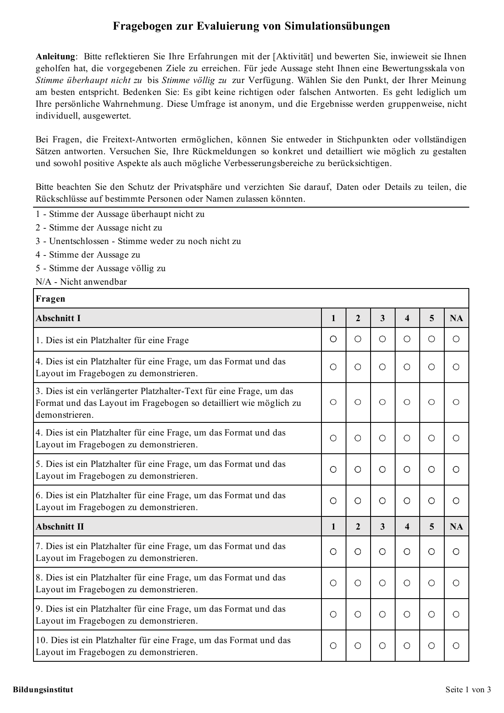

# Excel-Likert-Fragebogen-Template

## Beschreibung
Dieses anpassbare Excel-Template wurde entwickelt, um die Evaluierung von Simulationssitzungen zu unterstützen. Es ist speziell für die Erstellung von Fragebögen mit Likert-Skalen konzipiert und enthält integrierte Makros für das Drucken des Fragebogens und die Korrektur der Zentrierung von Designelementen. Das Ziel war es, den Evaluierungsprozess in der Pflegeausbildung praktischer und effizienter zu gestalten. Ich hoffe, es erleichtert Ihnen die Gestaltung eigener Fragebögen.

## Screenshots

## Verwendung
1. Laden Sie die Excel-Datei aus diesem Repository herunter.
2. Passen Sie die Kopf- und Fußzeile an die Gegebenheiten Ihrer Umfrage oder Studie an.
3. Passen Sie die Fragen auf der ersten Tabellenseite an Ihre spezifischen Bedürfnisse an.
4. Auf der zweiten Tabellenseite können Sie eigene Freitextfragen hinzufügen.
5. Stellen Sie sicher, dass die Designelemente (z. B. kleine Kreise) korrekt positioniert sind. Falls sie verrutschen, nutzen Sie die Makro-Schaltfläche *Zentrierung korrigieren*.
7. Wenn Sie bereit sind, den Fragebogen zu drucken, klicken Sie einfach auf die Makro-Schaltfläche *Fragebogen drucken*.
8. Nutzen Sie den Fragebogen, um Daten von den Befragten zu sammeln.

## Anforderungen
- Microsoft Excel mit Makro-Unterstützung (Version 2016 oder neuer wird empfohlen)
- Makros müssen in Excel aktiviert sein, um die Makro-Funktionen *Zentrierung korrigieren* und *Fragebogen drucken* nutzen zu können.
- Grundlegende Excel-Kenntnisse für die Anpassung des Fragebogens

## Feedback und Beiträge
Feedback ist immer willkommen! Wenn Sie Vorschläge zur Verbesserung haben oder Fehler finden, erstellen Sie bitte ein Issue oder einen Pull Request.
